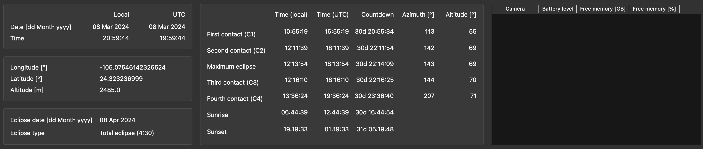
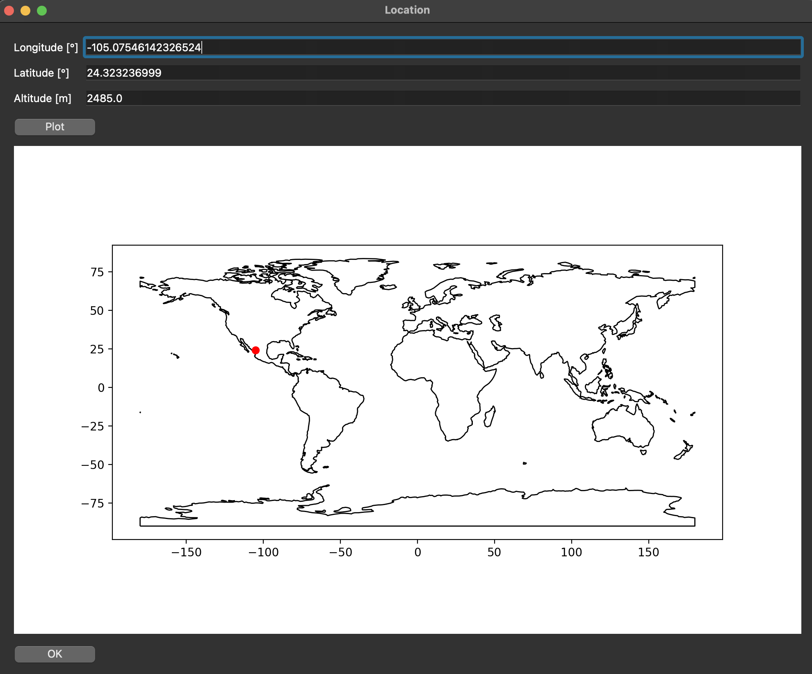
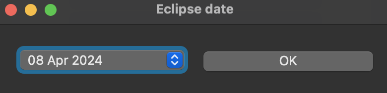
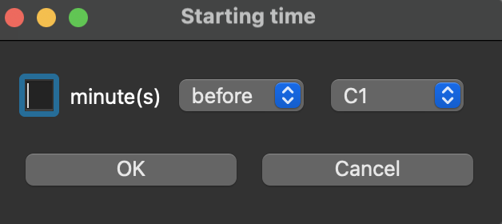
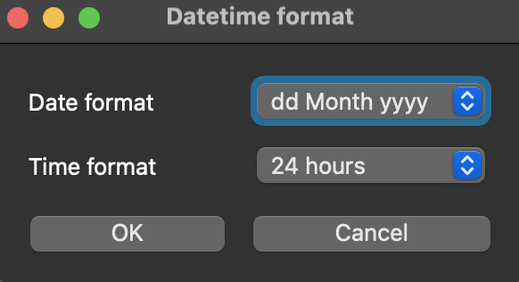

# Solar Eclipse Workbench


## Table of contents

[//]: # (- [Solar Eclipse Workbench]&#40;#solar-eclipse-workbench&#41;)
[//]: # (  - [Table of contents]&#40;#table-of-contents&#41;)
- [Solar Eclipse Workbench](#solar-eclipse-workbench)
  - [Table of contents](#table-of-contents)
  - [Installation instructions](#installation-instructions)
    - [Installation on macOS](#installation-on-macos)
    - [Installation on Ubuntu 22.04](#installation-on-ubuntu-2204)
    - [Installation on Windows 11](#installation-on-windows-11)
  - [Running Solar Eclipse Workbench](#running-solar-eclipse-workbench)
    - [Command line parameters](#command-line-parameters)
    - [UI functionality](#ui-functionality)
      - [Observing location](#observing-location)
      - [Eclipse date](#eclipse-date)
      - [Reference moments](#reference-moments)
      - [Camera overview](#camera-overview)
      - [Simulation mode](#simulation-mode)
      - [Job scheduling](#job-scheduling)
      - [Interrupting scheduled jobs](#interrupting-scheduled-jobs)
      - [Datetime format](#datetime-format)
      - [Saving settings](#saving-settings)
  - [Script file format](#script-file-format)
    - [General remarks](#general-remarks)
    - [Commands](#commands)
  - [Shortcomings](#shortcomings)
  - [Converting scripts from Solar Eclipse Maestro](#converting-scripts-from-solar-eclipse-maestro)
    - [Known Solar Eclipse Maestro commands](#known-solar-eclipse-maestro-commands)
  - [Image attributions](#image-attributions)
    - [GUI icons](#gui-icons)

## Installation instructions

### Installation on macOS

- Install poetry by executing the following line in the terminal

```bash
curl -sSL https://install.python-poetry.org | sed 's/symlinks=False/symlinks=True/' | python3 -
```

- For modern Apple Mac computers (using Apple Silicon processors), install [homebrew](https://brew.sh/). Add your homebrew/bin directory to your PATH. Then install gphoto2 using homebrew:

```bash
export PATH=<location_of_homebrew_installation>/bin:$PATH
brew install gphoto2 pkg-config
```

- Check out the source code:

```bash
git clone https://github.com/AstroWimSara/SolarEclipseWorkbench.git
cd SolarEclipseWorkbench
```

- Install the python environment by executing the following command in the Solar Eclipse Workbench directory

```bash
poetry install
poetry shell
pip3 install PyObjC
```

### Installation on Ubuntu 22.04

- Install poetry by executing the following line in the terminal

```bash
sudo apt install curl git
/usr/bin/curl -sSL https://install.python-poetry.org | sed 's/symlinks=False/symlinks=True/' | /usr/bin/python3 -
```

- Check out the source code:

```bash
git clone https://github.com/AstroWimSara/SolarEclipseWorkbench.git
cd SolarEclipseWorkbench
```

- Install the python environment by executing the following command in the Solar Eclipse Workbench directory

```bash
~/.local/bin/poetry install
~/.local/bin/poetry shell
```

- Eventually, to make the sound notifications a bit faster, install pygobject:

```bash
sudo apt install libcairo2-dev libgirepository1.0-dev gcc
pip install pygobject
```

### Installation on Windows 11

- GPhoto2 is only available for Linux and macOS.  To run Solar Eclipse Workbench, wsl should be used.
- Open a terminal in Windows
- Install wsl by executing the command

```bash
wsl --install
```

- Start using wsl by typing `wsl` in a new terminal.
- Install poetry by executing the following line in the terminal

```bash
curl -sSL https://install.python-poetry.org | sed 's/symlinks=False/symlinks=True/' | python3 -
```

- Check out the source code:

```bash
git clone https://github.com/AstroWimSara/SolarEclipseWorkbench.git
```

- Log out from wsl (by typing `exit`) and log in again.
- Install the python environment by executing the following command in the Solar Eclipse Workbench directory

```bash
cd SolarEclipseWorkbench
poetry install
poetry shell
```

- Install needed packages

```bash
sudo apt install libgstreamer1.0-dev libgstreamer-plugins-base1.0-dev libxkbcommon-x11-0 libxcb-cursor0 libcairo-dev
```

- Eventually, to make the sound notifications a bit faster, install pygobject:

```bash
sudo apt install libcairo2-dev libgirepository1.0-dev gcc python3-dev gobject-* gir1.2-*
pip install pygobject
```

### Make cameras accessible in wsl

The USB devices are not automatically accessible in wsl.  To make the cameras accessible, the following steps should be taken:
- Download the usbipd-win package from [GitHub](https://github.com/dorssel/usbipd-win/releases)
- Install the package
- Start a PowerShell terminal as administrator
- Connect the cameras to the computer
- Execute the following command in the PowerShell terminal

```bash
usbipd list
```

- The cameras should be listed (with their camera name or as MTP USB Device).  The camera_id is the busid of the camera.  This can be found in the list of usbipd list.  The camera_id is a number with a colon and a number (e.g. 1:2).  The command to bind the camera to wsl is

```bash
usbipd bind --busid <camera_id>
```

- Attach the camera to wsl by executing the following command in a PowerShell terminal.  Make sure that a wsl terminal is also open. **This should be done every time the camera is connected to the computer!!**

```bash
usbipd attach --wsl --busid <camera_id>
```

- The camera should now be available in wsl. You can test this by executing the following command:

```bash
lsusb
```

- The camera can not be accessed yet by the normal user.  To make this work, the user should be added to the plugdev group.  This can be done by executing the following command in the wsl terminal, and log in into :

```bash 
sudo usermod -aG plugdev $USER
```

## Running Solar Eclipse Workbench

- Before starting Solar Eclipse Workbench, make sure to enable the correct python environment by executing the following command in the installation directory:

```bash
~/.local/bin/poetry shell
```

- The main script to start is `gui.py`.  You can add a parameters to set the needed parameters for the eclipse.  Some examples:

```bash
# On macos, start the commands with sudo
sudo python src/solareclipseworkbench/gui.py -d 2024-04-08 -lon -104.63525 -lat 24.01491 -alt 1877.3
sudo python src/solareclipseworkbench/gui.py

# In Linux or using WSL on Windows, start the command without sudo
python src/solareclipseworkbench/gui.py -d 2024-04-08 -lon -104.63525 -lat 24.01491 -alt 1877.3
python src/solareclipseworkbench/gui.py
```

- There is a problem with `gphoto2`.  On macOS, Solar Eclipse Workbench needs to be started with sudo rights to be able to connect to the cameras.  In Linux (or Windows using wsl), sudo should not be used.
- The first time you run Solar Eclipse Workbench, some files are downloaded from the internet.  Make sure to do this before eclipse day!

### Command line parameters

The following command line parameters can be used to start up gui.py.


| Short parameter | Long parameter        | Description                                                                |
|-----------------|-----------------------|----------------------------------------------------------------------------|
| -h              | --help                | Show the help message and exit                                             |
| -d DATE         | --date DATE           | Date of the solar eclipse (in YYYY-MM-DD format)                           |
| -lon LONGITUDE  | --longitude LONGITUDE | Longitude of the location where to watch the solar eclipse (W is negative) |
| -lat LATITUDE   | --latitude LATITUDE   | Latitude of the location where to watch the solar eclipse (N is positive)  |
| -alt ALTITUDE   | --altitude ALTITUDE   | Altitude of the location where to watch the solar eclipse (in meters)      |

### UI functionality

In the images below, a screenshot of the toolbar and the upper part of the UI are shown.


The icons on the UI toolbar must be clicked from left to right (and the required data must be provided, if applicable) in order for the values in the upper section of the UI to appear.  Alternatively, the data can be passed as command line arguments at start-up, as discussed in the previous section.



The functionality of the toolbar buttons is as follows (from left to right):

#### Observing location

- When pressing the "Location" icon, a pop-up window (see screenshot below) will appear, in which you are asked to fill out the longitude, latitude, and altitude of your observing location.  Both longitude and latitude are expressed in degrees, the altitude in meters.
- If these data were already inserted before somehow (manually, via command line arguments, or by loading a settings file), these values will appear there (you can modify them as you see fit).
- When pressing the "Plot" button, the specified location (longitude, latitude) will be marked with a red dot on the world map.  Note that this plot is not updated automatically when you change the values.
- When pressing the "OK" button, the data are accepted and will be filled out in the top section of the UI.



#### Eclipse date

- When pressing the "Date" icon, a pop-up window (see screenshot below) will appear, in which you can choose the date of the eclipse from a drop-down menu.  At any moment in time, the next 20 solar eclipses are included in the list.
- When pressing the "OK" button, the selected eclipse date is accepted and will be filled out in the top section of the UI.



#### Reference moments

- When pressing the "Reference moments" icon, the information for the reference moments of the eclipse is filled out in the top section of the UI.
- The reference moments of the eclipse are:
  - C1 (first contact);
  - C2 (second contact);
  - MAX (maximum eclipse);
  - C3 (third contact);
  - C4 (fourth contact);
  - sunrise;
  - sunset.
- The information that is shown for each of these reference moments is:
  - Time in the local timezone;
  - Time in UTC;
  - Countdown;
  - Altitude (in degrees);
  - Azimuth (in degrees).
- This information can only be populated when the location and the eclipse date have been indicated.  Note that the reference moments are not automatically updated in case either of them would be modified.
- Together with the information about the reference moments, the eclipse type (partial / total / annular) will be displayed.  For total and annular eclipses, also the time between C2 and C3 will be shown (next to the eclipse type).

#### Camera overview

- When pressing the "Camera" icon, the camera overview in the top section of the UI will be updated.  This shows for each camera the following information:
  - Camera name;
  - Battery level (in percentage);
  - Free memory (both in percentage and in GB).
- Apart from updating the camera information in the UI, the following is done for all cameras:
  - Syncing the time with the time of the computer the camera is connected to;
  - Checking whether for the focus mode and the shooting mode are set to "Manual".  If this is not the case, a warning message is logged in the Console where the UI was started.

#### Simulation mode

- The "Simulation" icon will only be available in the toolbar when the UI is started in simulator mode (i.e. with the command line argument `-s` or `--sim`).
- When pressing this icon, a pop-up window (see screenshot below) will appear, in which you can specify when (w.r.t. one of the reference moments of the eclipse) you want to start the simulation.
- When pressing the "OK" button, the selected relative starting time of the simulation will be stored.  It will be applied when the jobs are being scheduled (see next section).



#### Job scheduling

- When pressing the "File" icon, a file chooser will pop up, in which you can select the desired TXT file with the scheduled commands.
- When a file with scheduled commands is indeed selected, the scheduled jobs will appear in the bottom section of the UI.  As the timing of the commands is expressed in the loaded file w.r.t. the reference moments of the eclipse, you have to make sure that the information about the reference moments has already been filled out in the top section of the UI.
- When jobs are scheduled and hence displayed in the bottom part of the UI, the following information is shown for each job:
  - Countdown;
  - Execution time in the local timezone;
  - Execution time in UTC;
  - Representation of the command;
  - Description of the command.
- Important to know when in simulation mode:
  - Jobs that were scheduled in the past w.r.t. the start of the simulation, will not appear in the list of scheduled jobs.
  - The displayed local execution time of the jobs corresponds to the local time at the observing location, so this may be different from the timezone on you laptop (e.g. when you would be practising beforehand at home).

#### Interrupting scheduled jobs

- In case the scheduled jobs would have to be interrupted (e.g. because you realised - hopefully in time - that you did not select the correct file), you have to press the "Stop" icon.  The scheduler will be shut down and the scheduled jobs will disappear from the bottom section of the UI.
- Use this icon with caution!

#### Datetime format

- When pressing the "Datetime format" icon, a pop-up window (see screenshot below) will appear, in which you can specify the date and time format.
- When pressing the "OK" button, the selected date and time format will be applied to all dates and times that are or will be displayed in the UI.
- When pressing the "Cancel" button, the old formatting will be kept.



#### Saving settings

- When pressing the "Save" icon, the location and eclipse date (if selected) will be stored in a settings file, together with the applied date and time format.
- The standard settings framework of `PyQt6` (`QSettings`) will be used: it stores the settings as `SolarEclipseWorkbench.ini`.
- Next time you open the UI (from the same location), this settings file will be loaded and the specified data will be made available in the UI.
- In case command line arguments are used to open the UI, these take priority over the values from the settings file.

## Script file format

### General remarks

Test your script before using it during a total solar eclipse!  Some cameras can take pictures very fast, some cameras need some time between taking two different pictures.

The following cameras are tested:

- Canon EOS 1000D: 1 picture every two seconds
- Canon EOS 80D: 1 picture every two seconds
- Canon EOS R: 1 picture every two seconds
- Nikon DSC D3400: 1 picture every three seconds

It is possible to take pictures in burst mode.  The speed is limited by the speed of the camera (and card).

### Commands

Solar Eclipse Workbench can use the following commands:

- **take_picture** - Set the aperture (use 8 instead of 8.0), shutter speed and ISO of the camera and take a picture.

```take_picture, C1, -, 0:01:02.0, Canon EOS 80D, 1/1250, 8, 200, "Pre-C1 uneclipsed (Iter. 1)"```

This command will take a picture 1 minutes and 2 seconds before first contact (C1) with the Canon EOS 80D.  The ISO will be set to 200, aperture to 8.0 and shutter speed to 1/1250s.

- **take_burst**  - Set the aperture, shutter speed and ISO of the camera and take a burst of pictures during 3 seconds (for Canon, Nikon will take 3 pictures in burst mode).

```take_burst, C1, +, 0:00:08.0, Canon EOS 80D, 1/2000, 5.6, 400, 3, "Burst test"```

- **take_bracket**   -  Set the aperture, shutter speed and ISO of the camera and take a bracket of 5 pictures with the given steps.  This method only works in Canon cameras.  Make sure to have 5 steps enabled for bracketing.  Options for the steps are: +/- 1/3, +/- 2/3, +/- 1, +/- 1 1/3, +/- 1 2/3, +/- 2, +/- 2 1/3, +/- 2 2/3, +/- 3

```take_bracket, C1, +, 0:00:08.0, Canon EOS 80D, 1/2000, 5.6, 400, "+/- 1 2/3", "Bracket test"```

- **voice_prompt** - Play a sound file.

```voice_prompt, C4, -, 00:00:03, C4_IN_3_SECONDS, "3 seconds before C4 voice prompt"```

This command will play the C4_IN_3_SECONDS sound file 3 seconds before fourth contact (C4).

- **sync_cameras** - Read out the camera settings

```sync_cameras, C2, -, 00:00:04, "Sync the camera status"```

- **for** - Repeat a command a number of times

```for,C1,C4,10,-10,+10```

This command will repeat the commands between C1 and C4 with an interval of 10 seconds.  The for loop will start 10 seconds before C1 and will end 10 seconds after C4.
All commands that follow will be repeated up to the **endfor** command.  The time for the commands will be adapted automatically.

Example 1:

```
for,C1,C4,10,-10.0,10.0
take_picture,(VAR), +, 0:00:00.0, Canon EOS 80D, 1/1250, 6, 100, "Partial C1-C4"
take_picture,(VAR), +, 0:00:00.0, Canon EOS R, 1/800, 8, 100, "Partial C1-C4"
endfor
```

Example 2:

```
for,C1,C4,600,-20.0,10.0
sync_cameras,(VAR), +, 00:00:00, "Sync the camera status"
endfor
```

- It is also possible to use the following commands from Solar Eclipse Maestro:

| Command              | Since version |
|----------------------|---------------|
| FOR,(INTERVALOMETER) | 1.0           |
| TAKEPIC              | 1.0           |
| PLAY                 | 1.0           |
| TAKEBST              | 1.0           |
| TAKEBKT              | 1.0           |


## Shortcomings

- In normal mode, only one picture every two seconds can be made.
- The computer you are using will probably fall asleep during the solar eclipse.  You can prevent this on macOS using [caffeine](https://www.caffeine-app.net/).  On Windows, you can use the Windows [powertoys](https://awake.den.dev/). 

## Converting scripts from Solar Eclipse Maestro

Scripts from Solar Eclipse Maestro are converted automatically to scripts that can be used by Solar Eclipse Workbench.

## Image attributions

### GUI icons

- <a href="https://www.flaticon.com/free-icons/map" title="map icons">Map icons created by Freepik - Flaticon</a>
- <a href="https://www.flaticon.com/free-icons/clock" title="clock icons">Clock icons created by Freepik - Flaticon</a>
- <a href="https://www.flaticon.com/free-icons/camera" title="camera icons">Camera icons created by Freepik - Flaticon</a>
- <a href="https://www.flaticon.com/free-icons/calendar" title="calendar icons">Calendar icons created by Freepik - Flaticon</a>
- <a href="https://www.flaticon.com/free-icons/settings" title="settings icons">Settings icons created by Freepik - Flaticon</a>
- <a href="https://www.flaticon.com/free-icons/stop-sign" title="stop sign icons">Stop sign icons created by Freepik - Flaticon</a>
- <a href="https://www.flaticon.com/free-icons/folder" title="folder icons">Folder icons created by Freepik - Flaticon</a>
- <a href="https://www.flaticon.com/free-icons/simulation" title="simulation icons">Simulation icons created by Freepik - Flaticon</a>
- <a href="https://www.flaticon.com/free-icons/save" title="save icons">Save icons created by Freepik - Flaticon</a>
